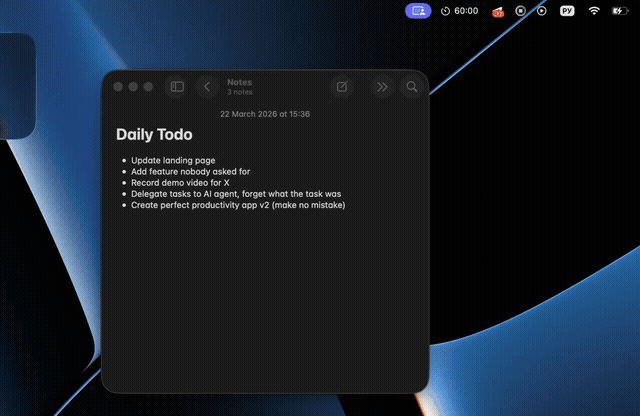

# FocusTimer

A minimal macOS menu bar app for deep work sessions — built with Swift 6, SwiftUI, and Apple Notes integration.


<br>

[](https://x.com/i/status/2035691910187090115)

---

## What it does

FocusTimer lives in your menu bar. You pick a task from Apple Notes, start the timer, and when the session ends — the log is written directly back into the note, prepended to the exact bullet line you were working on.

No Electron. No cloud. No subscriptions. Just a native `.app` you build yourself in 10 seconds.

---

## Features

- **Menu bar timer** — always visible, never in the way
- **Apple Notes integration** — read tasks from any note, write session logs back inline
- **Focus Mode** — auto-enables macOS Do Not Disturb when the timer starts
- **Custom duration** — type any `MM:SS` value, not just preset intervals
- **Session history** — last 8 sessions with task name, note, and duration
- **Export** — dump all sessions to JSON or CSV
- **Grain UI** — dark monochrome interface with mesh orange accent

---

## Build

Requires Xcode Command Line Tools.

```bash
git clone https://github.com/larsen66/FocusTimer
cd FocusTimer
./build.sh
open dist/FocusTimer.app
```

On first launch macOS will ask for:
- **Notifications** permission — for session completion alerts
- **Notes access** — for reading and writing tasks (via AppleScript)

---

## Focus Mode setup

When you enable the Focus Mode checkbox for the first time, the app auto-generates two Shortcuts (`Focus On` / `Focus Off`) and opens them in the Shortcuts app. Click **Add** on each — that's the only setup required.

---

## Notes log format

Each completed session prepends a compact entry to the selected bullet line:

```
[22.03, 14:30][25 min] Record demo video
```

---

## Stack

| Layer | Tech |
|---|---|
| Language | Swift 6.2, strict concurrency |
| UI | SwiftUI + AppKit (NSStatusItem, NSPopover) |
| Timer | DispatchSourceTimer on main queue |
| Notes | NSAppleScript bridge |
| Focus | Shortcuts CLI (auto-generated) |
| Persistence | JSON in ~/Library/Application Support |
| Build | SPM + custom build.sh, no Xcode project |

---

## Project structure

```
Sources/FocusTimer/
├── main.swift                 — entry point
├── AppDelegate.swift          — status bar, popover, wiring
├── TimerEngine.swift          — @Observable timer state machine
├── Session.swift              — Codable session model
├── SessionStore.swift         — JSON persistence
├── NotesIntegration.swift     — AppleScript ↔ Notes bridge
├── FocusMode.swift            — Do Not Disturb via Shortcuts
├── NotificationManager.swift  — UNUserNotificationCenter
├── PopoverView.swift          — design tokens, grain overlay, tab bar
├── TimerDisplayView.swift     — main timer UI + note/task picker
└── SettingsView.swift         — duration input, history, export
```

---

MIT License
